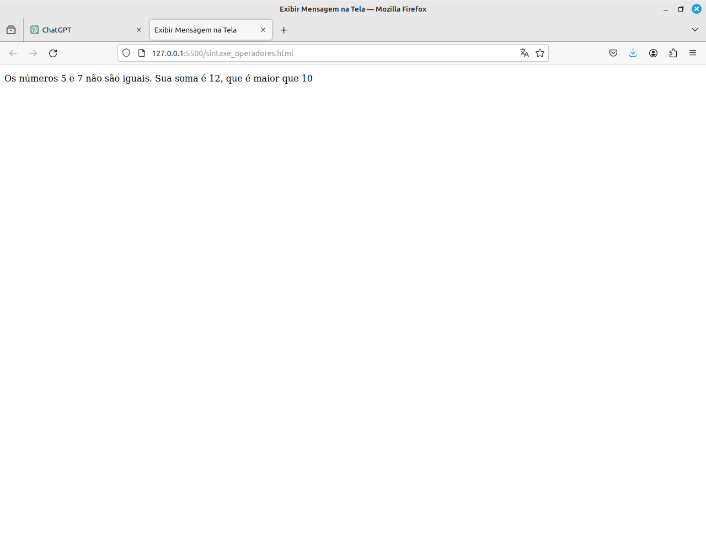

# Sintaxe Operadores

### Atividade 

Crie uma função que recebe dois números como parametros.
Confira se os números são iguais.
Confira se a soma dos números é maior que 10 ou menor que 20.
Retorne uma string dizendo "Os numeros num1 num2 não/são iguais. Sua soma é soma, que é maior/menor que 10 e maior/menor que 20"

